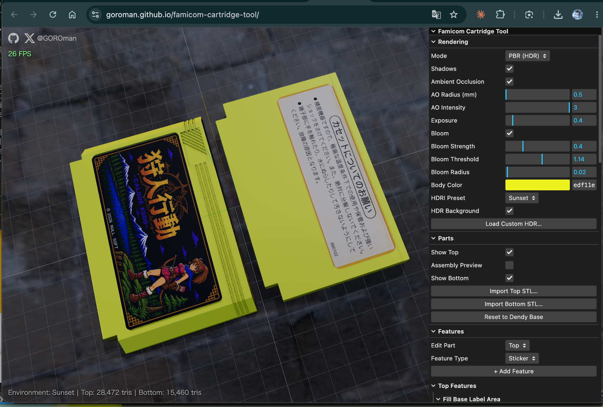

# Famicom Cartridge Tool

Browser-based parametric STL editor for 3D-printable Famicom (Dendy) cartridge shells.
Import the base top/bottom shell STLs, add parametric features (grooves, label recess,
boolean cuts, engraved/embossed text) and export print-ready binary STL files.

**Live app:** https://goroman.github.io/famicom-cartridge-tool/



## Features

- **STL import / export** — binary STL, drag & drop or file picker; export top, bottom, or both
- **Parametric feature stack** (non-destructive, per part, CSG via [Manifold](https://github.com/elalish/manifold) — output is guaranteed watertight, so exported STLs import cleanly into slicers)
  - **Groove** — axis, position, width, depth, length, count and spacing
  - **Label Recess** — rounded-rectangle sticker recess with size, depth, corner radius, on/off; drag the corner/center handles in the viewport to resize and move it
  - **Box / Cylinder** — generic boolean add/subtract primitives
  - **Text** — engrave or emboss with size, depth, position, rotation
  - **Sticker** — import a PNG/JPG (file picker or drag & drop) and place it as a textured label with size/position/rotation/opacity (display-only preview, not exported)
- **Rendering** — Wireframe / Simple shaded / PBR with HDR environment
  - 4 bundled HDRI presets (Studio, Sunrise, Sunset, Night — CC0 from [Poly Haven](https://polyhaven.com/)) plus a procedural room default, or drop in your own `.hdr`
- **Shadows** — soft shadow mapping with a toggle
- **Ambient occlusion** — GTAO post-processing with radius/intensity controls, plus a ray-traced **AO bake** (hemisphere sampling into vertex colors, view-independent like a lightmap)
- **Anti-aliasing** — MSAA in direct rendering, SMAA in the post-processing chain
- **Assembly preview** — toggle animates the two shells closing into a complete cartridge

## Development

```sh
npm install
npm run dev     # local dev server
npm run build   # production build into dist/
```

Deployed automatically to GitHub Pages via GitHub Actions on push to `main`.

## Base model — attribution

The bundled base shells in `public/models/` are
["Dendy (Famicom) cartridge"](https://www.thingiverse.com/thing:3357677) (Thingiverse #3357677)
by [5rw](https://www.thingiverse.com/5rw), licensed under
[Creative Commons — Attribution (CC BY)](https://creativecommons.org/licenses/by/4.0/).

Changes made: files renamed (`Dendy.stl` → `Dendy_bottom.stl`); the app applies
user-controlled CSG modifications (label-area fill, recesses, grooves, text, etc.)
at runtime. Units are millimetres, Z-up.

The bundled HDRI environments in `public/hdri/` are CC0 from [Poly Haven](https://polyhaven.com/).
The tool's own source code is MIT licensed.
